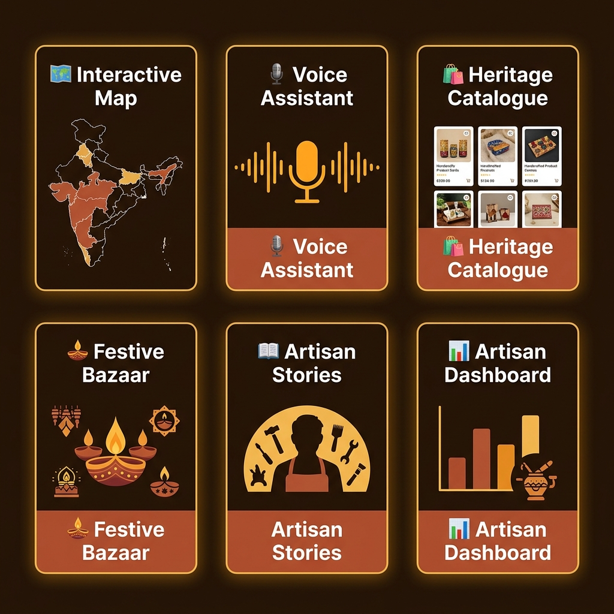
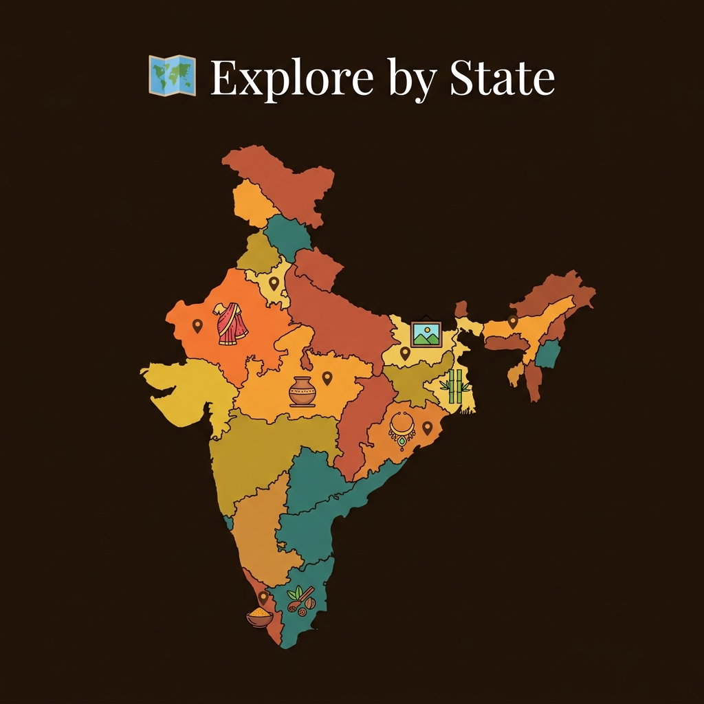

<div align="center">


<br/><br/>

<p>
  
  
  
  
  
</p>

<h3>🪔 A Digital Heritage Marketplace for India's Rural Artisans</h3>
<p><em>Preserving and promoting India's rural craftsmanship through voice assistance,<br/>interactive maps, and a seamless digital bazaar.</em></p>

<a href="https://himansh1610.github.io/Mrittika/"><strong>🌐 View Live Demo »</strong></a>
&nbsp;&nbsp;·&nbsp;&nbsp;
<a href="https://github.com/himansh1610/Mrittika/issues"><strong>🐛 Report Bug</strong></a>
&nbsp;&nbsp;·&nbsp;&nbsp;
<a href="https://github.com/himansh1610/Mrittika/issues"><strong>✨ Request Feature</strong></a>

</div>

---

## 🌟 Overview

**Mrittika** (मृत्तिका — Sanskrit for *clay/earth*) is a full-stack React web application that serves as a digital platform for Indian handicraft artisans and conscious buyers. The platform bridges the gap between rural artisan communities across India and modern consumers, offering a curated, culturally rich shopping experience rooted in heritage.

> 🏆 Built as a showcase for the **Digital Heritage Marketplace** initiative — HastKala MP empowers artisans from states like Madhya Pradesh, Rajasthan, Bihar, Kerala, West Bengal, and more.

---

## ✨ Features

<div align="center">

</div>

<br/>

### 🛍️ For Buyers
| Feature | Description |
|---|---|
| 🗂️ Heritage Catalogue | Browse 100+ authentic handcrafted products across 9 curated categories |
| 🗺️ Interactive Map | Explore crafts by their state of origin across India |
| 🪔 Festive Bazaar | Custom collections for Diwali, Holi, Navratri, Ganesh Chaturthi & Raksha Bandhan |
| 🎙️ Voice Assistant | Add items to cart, search products, and navigate — hands-free |
| 📖 Artisan Stories | Rich product detail modals with artisan backstory and craft history |
| 🛒 Smart Cart | Quantity management, order summary, and one-tap checkout |

### 🧑‍🎨 For Artisans
| Feature | Description |
|---|---|
| 📊 Artisan Dashboard | List new products, manage inventory, and track sales |
| कारीगर गाथा | Dedicated storytelling section to share your journey and legacy |
| 🔐 Role-based Access | Separate views for Customers, Artisans, and Admins |

---

## 🗺️ Explore by State

<div align="center">

</div>

<br/>

> Click any state on the interactive map to instantly filter and browse crafts sourced from that region.

**States covered:** `Madhya Pradesh` · `Rajasthan` · `Bihar` · `Jammu & Kashmir` · `West Bengal` · `Odisha` · `Kerala`

---

## 🗂️ Product Categories

<div align="center">

| | Category | Highlights |
|---|---|---|
| 🏺 | Pottery | Hand-thrown earthen diyas, vases, temple bells |
| 🧵 | Handloom & Textiles | Maheshwari sarees, Banarasi silk, block-print dupattas |
| 🪵 | Wooden Crafts | Sandalwood carvings, lacquerware, tribal boxes |
| 🎍 | Bamboo Crafts | Eco-friendly baskets, wind chimes, utility items |
| 💍 | Handmade Jewelry | Lac bangles, tribal beadwork, silver anklets |
| 🖼️ | Paintings & Wall Art | Madhubani, Gond, Warli folk art prints |
| 🕉️ | God Idols & Spiritual | Eco-friendly Ganesha, brass Lakshmi, clay Nataraj |
| 🌿 | Beauty & Wellness | Herbal rose water, kumkum, organic face packs |
| 🍯 | Local Foods | Pure honey, makhana, dry fruits, traditional papad |

</div>

---

## 🛠️ Tech Stack

<div align="center">

</div>

<br/>

<div align="center">

| Layer | Technology | Version |
|---|---|---|
| **Framework** | React | 19 |
| **Build Tool** | Vite | 8 |
| **Icons** | Lucide React | Latest |
| **Animations** | Canvas Confetti | ^1.9.4 |
| **Deployment** | GitHub Pages | via Actions |
| **Linting** | ESLint | 10 |
| **Styling** | Vanilla CSS | Custom Design System |

</div>

---

## 🚀 Getting Started

### Prerequisites
- Node.js ≥ 18
- npm ≥ 9

### Installation

```bash
# 1. Clone the repository
git clone https://github.com/himansh1610/Mrittika.git
cd Mrittika

# 2. Install dependencies
npm install

# 3. Start development server
npm run dev
```

> Open [http://localhost:5173](http://localhost:5173) in your browser 🎉

### Other Commands

```bash
npm run build      # Build for production → outputs to /dist
npm run preview    # Preview production build locally
npm run lint       # Run ESLint checks
```

---

## 📁 Project Structure

```
mrittika/
├── 📂 docs/
│   └── assets/             # README images and visuals
├── 📂 public/              # Static assets
├── 📂 src/
│   ├── 📂 components/      # Reusable UI components
│   │   ├── 📂 auth/        # Login, Signup, Onboarding flows
│   │   ├── Navbar.jsx      # Top navigation with search & cart
│   │   ├── Hero.jsx        # Landing hero section
│   │   ├── InteractiveMap.jsx   # India state map explorer
│   │   ├── VoiceAssistant.jsx   # Floating AI voice assistant 🎙️
│   │   ├── TutorialSystem.jsx   # Guided onboarding overlay
│   │   ├── Dashboards.jsx       # Artisan & Admin dashboards
│   │   ├── ProductCard.jsx      # Product grid card
│   │   ├── ProductDetailsModal.jsx  # Full product story modal
│   │   └── CartModal.jsx        # Shopping cart drawer
│   ├── 📂 data/
│   │   ├── products.js     # Product catalogue data
│   │   └── artisans.js     # Artisan profiles & stories
│   ├── App.jsx             # Root application component
│   ├── App.css             # Global component styles
│   ├── index.css           # CSS design system & tokens
│   └── main.jsx            # React entry point
├── 📂 .github/
│   └── workflows/
│       └── deploy.yml      # ⚙️ CI/CD GitHub Pages deployment
├── vite.config.js
└── package.json
```

---

## 🔄 CI/CD Pipeline

```
Push to main
     │
     ▼
✅ Checkout Repo
     │
     ▼
📦 npm ci (Install Dependencies)
     │
     ▼
🔨 npm run build (Vite Production Build)
     │
     ▼
📤 Upload dist/ as Pages Artifact
     │
     ▼
🚀 Deploy to GitHub Pages ✓
```

Every push to `main` auto-deploys the latest build — zero manual steps.

---

## 🎭 User Roles

```
┌─────────────────────────────────────────────────────────┐
│                     Role Hierarchy                       │
│                                                         │
│  👤 Customer → Browse · Cart · Map · Festivals          │
│       ↓                                                 │
│  🧑‍🎨 Artisan → + List Products · Artisan Dashboard      │
│       ↓                                                 │
│  🛡️  Admin   → + Analytics Panel · Manage All          │
└─────────────────────────────────────────────────────────┘
```

---

## 🤝 Contributing

Contributions, issues, and feature requests are welcome! ❤️

```bash
# 1. Fork the repo on GitHub

# 2. Create your feature branch
git checkout -b feature/amazing-feature

# 3. Commit your changes
git commit -m "feat: add amazing feature"

# 4. Push to your fork
git push origin feature/amazing-feature

# 5. Open a Pull Request on GitHub 🎉
```

---

## 📜 License

Distributed under the **MIT License**. See [`LICENSE`](LICENSE) for more information.

---

<div align="center">


<br/><br/>

Made with ❤️ to preserve **India's living heritage**

**[🌐 Live Demo](https://himansh1610.github.io/Mrittika/)** &nbsp;·&nbsp; **[🐛 Report Bug](https://github.com/himansh1610/Mrittika/issues)** &nbsp;·&nbsp; **[⭐ Star this Repo](https://github.com/himansh1610/Mrittika)**

<br/>

*© 2026 HastKala MP — Developed for Digital Heritage Marketplace Showcase*

</div>